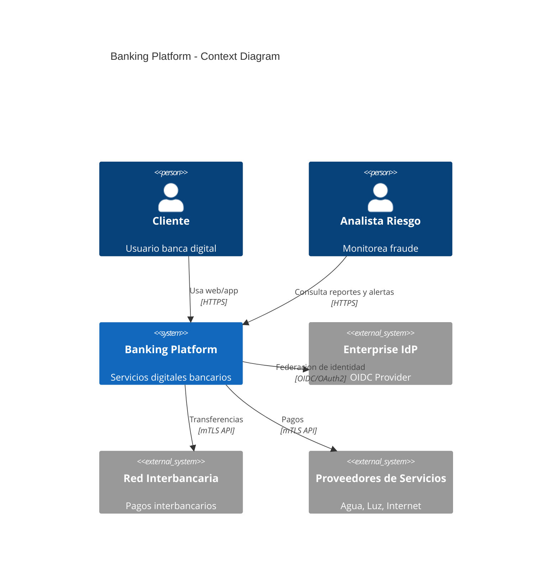
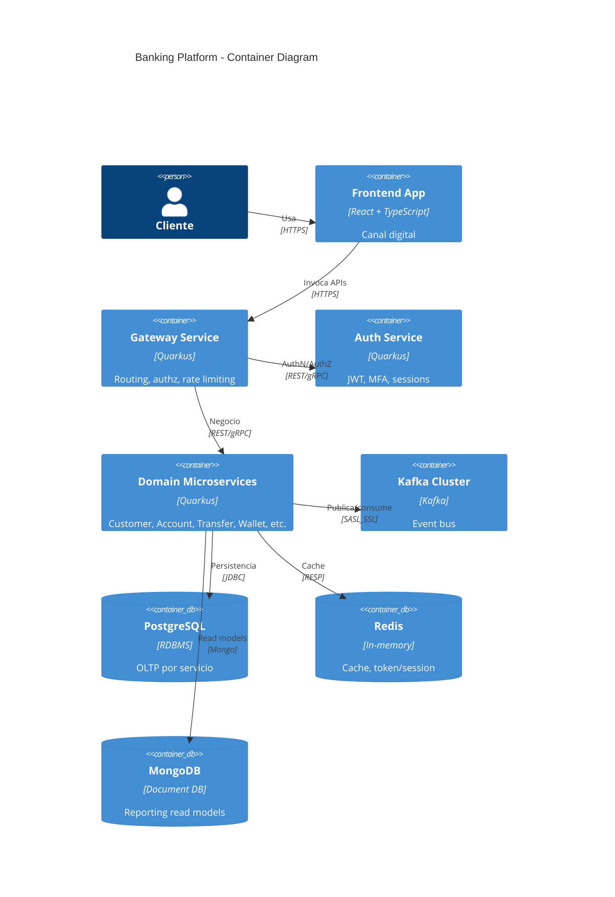
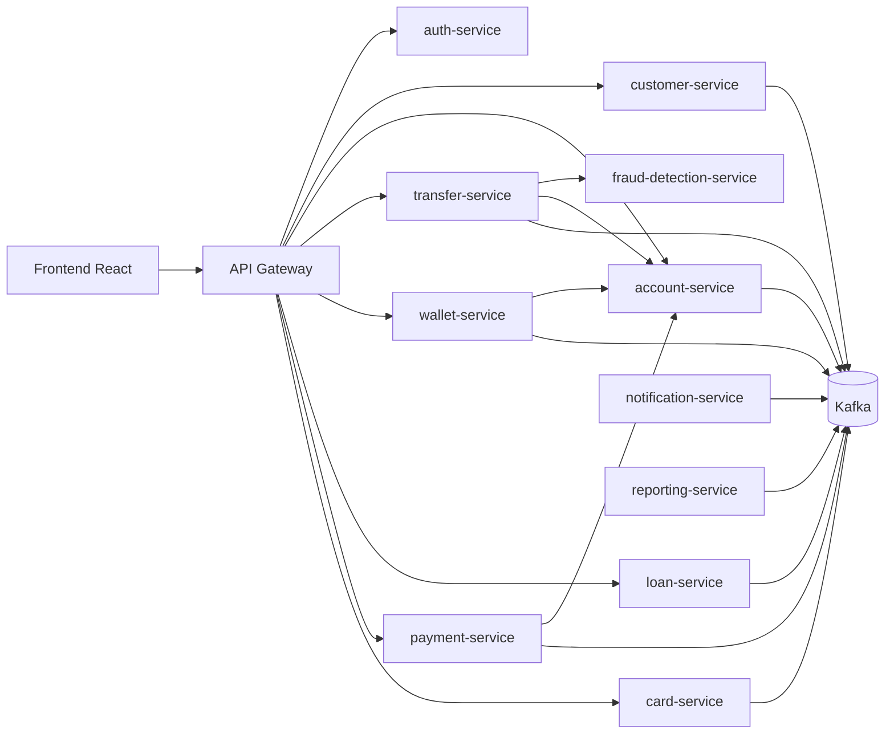
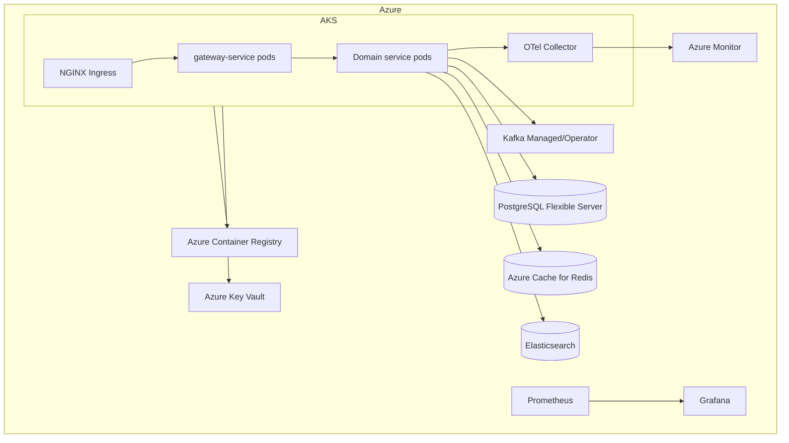
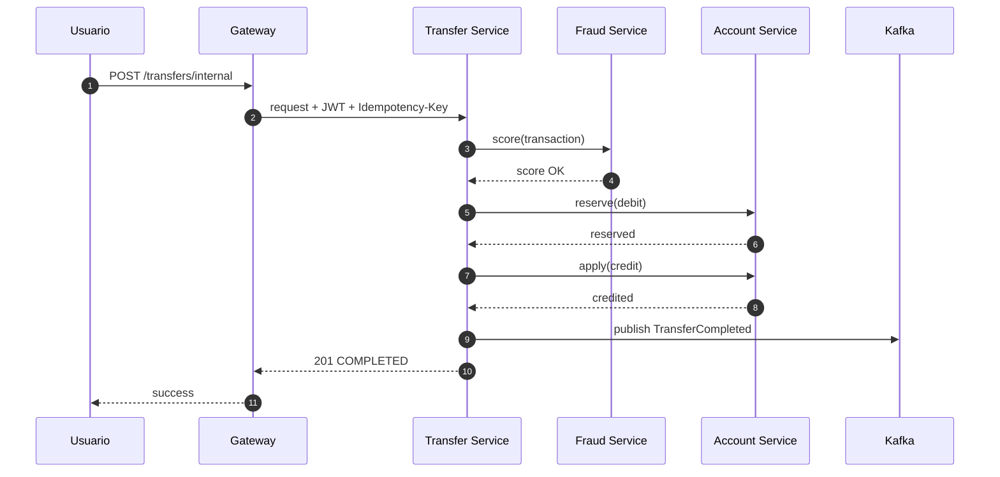

# Diseno Arquitectonico Enterprise

## 1. Arquitectura logica
- Frontend React (BFF opcional en gateway) consume API Gateway.
- Gateway enruta a microservicios Quarkus.
- Servicios persistentes por dominio (database-per-service).
- Integracion asincrona por Kafka + outbox transactional.
- Anti-fraude en tiempo real desacoplado via eventos.

## 2. Microservicios y responsabilidades
- auth-service: OIDC/OAuth2 integration, JWT issuance, MFA, session control.
- customer-service: onboarding, perfil, identidad, KYC state.
- account-service: lifecycle de cuentas, saldos, movimientos.
- card-service: tarjetas, limites, CVV dinamico, bloqueos.
- transfer-service: transferencias internas/interbancarias, saga orchestration.
- wallet-service: alias celular, QR, P2P transferencias instantaneas.
- loan-service: simulacion, solicitud, cronograma, cuotas.
- payment-service: pagos servicios, recargas, autopagos.
- reporting-service: proyecciones, KPIs, exportaciones.
- fraud-detection-service: reglas, scoring, alertas.
- notification-service: push, email, SMS, webhooks.
- config-service: configuracion centralizada/feature flags.
- gateway-service: authz edge, throttling, routing, observabilidad edge.

## 3. C4 - Context


## 4. C4 - Container


## 5. Diagrama de componentes (simplificado)


## 6. Diagrama de despliegue (AKS)


## 7. Secuencia transferencia interna (saga)


## 8. Eventos Kafka (catalogo inicial)
- `customer.created.v1`
- `customer.kyc.updated.v1`
- `account.created.v1`
- `account.balance.updated.v1`
- `transfer.initiated.v1`
- `transfer.completed.v1`
- `transfer.failed.v1`
- `wallet.payment.qr.completed.v1`
- `loan.approved.v1`
- `payment.service.completed.v1`
- `fraud.alert.raised.v1`
- `notification.dispatch.requested.v1`

### Ejemplo de payload
```json
{
  "eventId": "c96d4f57-6a2d-4adf-9bc9-1fe8a0c391d8",
  "eventType": "transfer.completed.v1",
  "occurredAt": "2026-05-15T16:21:44Z",
  "traceId": "b5a8e2a0c2f44e7d8ed5f0f8f2db6fc8",
  "data": {
    "transferId": "TRX-20260515-000991",
    "sourceAccountId": "ACC-1001",
    "targetAccountId": "ACC-1022",
    "amount": 120.50,
    "currency": "PEN",
    "status": "COMPLETED"
  }
}
```

## 9. ADRs
### ADR-001: Database per service
- Decision: cada microservicio posee su esquema/bd.
- Rationale: bajo acoplamiento y autonomia de despliegue.
- Consequence: consistencia eventual inter-servicios.

### ADR-002: Saga orchestration para transferencias
- Decision: transfer-service orquesta pasos de debito/credito.
- Rationale: control transaccional distribuido y compensaciones.
- Consequence: complejidad operativa adicional.

### ADR-003: Outbox pattern obligatorio en eventos de negocio
- Decision: persistir evento outbox en misma transaccion local.
- Rationale: evitar dual-write inconsistency.
- Consequence: componente relay adicional.

### ADR-004: gRPC interno + REST externo
- Decision: REST para canales externos, gRPC para trafico este-oeste sensible a latencia.
- Consequence: doble contrato y gobernanza API.

## 10. Niveles de resiliencia
- Retry con backoff exponencial y jitter para integraciones externas.
- Circuit breaker por dependencia remota.
- Bulkhead por pool de conexiones y thread limits.
- Timeout estricto por endpoint y tipo de operacion.
- Idempotencia para operaciones monetarias.
