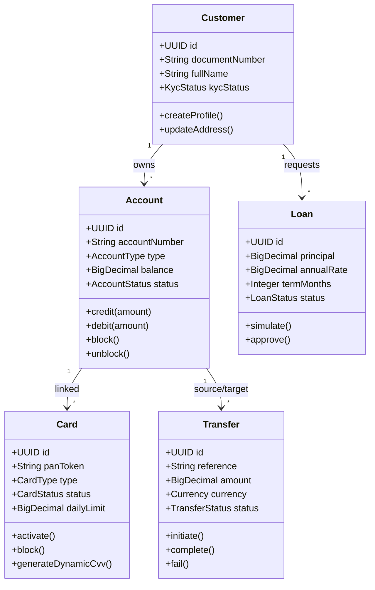
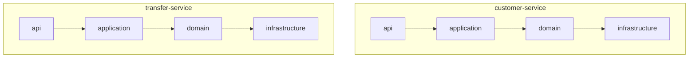
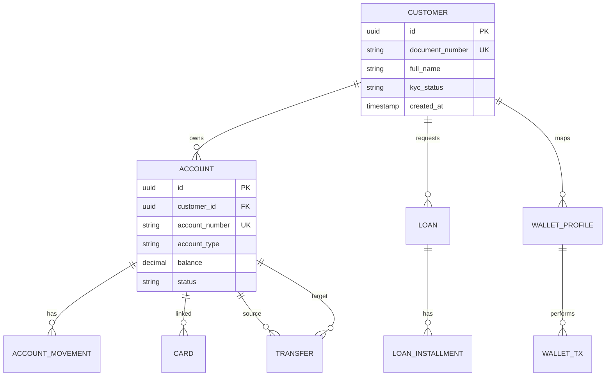
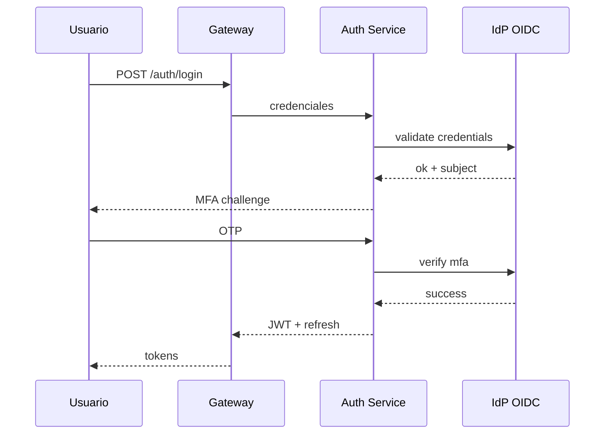

# UML y Modelado (Mermaid)

## 1. Diagrama de clases (dominio core)

```mermaid
classDiagram
    class Customer {
      +UUID id
      +String documentNumber
      +String fullName
      +KycStatus kycStatus
      +createProfile()
      +updateAddress()
    }

    class Account {
      +UUID id
      +String accountNumber
      +AccountType type
      +BigDecimal balance
      +AccountStatus status
      +credit(amount)
      +debit(amount)
      +block()
      +unblock()
    }

    class Card {
      +UUID id
      +String panToken
      +CardType type
      +CardStatus status
      +BigDecimal dailyLimit
      +activate()
      +block()
      +generateDynamicCvv()
    }

    class Transfer {
      +UUID id
      +String reference
      +BigDecimal amount
      +Currency currency
      +TransferStatus status
      +initiate()
      +complete()
      +fail()
    }

    class Loan {
      +UUID id
      +BigDecimal principal
      +BigDecimal annualRate
      +Integer termMonths
      +LoanStatus status
      +simulate()
      +approve()
    }

    Customer "1" --> "*" Account : owns
    Account "1" --> "*" Card : linked
    Account "1" --> "*" Transfer : source/target
    Customer "1" --> "*" Loan : requests
```

## 2. Diagrama de paquetes

```mermaid
flowchart TB
    subgraph customer-service
      CAPI[api]
      CAP[application]
      CDOM[domain]
      CINF[infrastructure]
    end
    subgraph transfer-service
      TAPI[api]
      TAP[application]
      TDOM[domain]
      TINF[infrastructure]
    end
    CAPI --> CAP --> CDOM --> CINF
    TAPI --> TAP --> TDOM --> TINF
```

## 3. Diagrama ER (alto nivel)

```mermaid
erDiagram
    CUSTOMER ||--o{ ACCOUNT : owns
    ACCOUNT ||--o{ ACCOUNT_MOVEMENT : has
    ACCOUNT ||--o{ CARD : linked
    CUSTOMER ||--o{ LOAN : requests
    LOAN ||--o{ LOAN_INSTALLMENT : has
    ACCOUNT ||--o{ TRANSFER : source
    ACCOUNT ||--o{ TRANSFER : target
    CUSTOMER ||--o{ WALLET_PROFILE : maps
    WALLET_PROFILE ||--o{ WALLET_TX : performs

    CUSTOMER {
      uuid id PK
      string document_number UK
      string full_name
      string kyc_status
      timestamp created_at
    }

    ACCOUNT {
      uuid id PK
      uuid customer_id FK
      string account_number UK
      string account_type
      decimal balance
      string status
    }
```

## 4. Diagrama de secuencia - login MFA

```mermaid
sequenceDiagram
    participant U as Usuario
    participant G as Gateway
    participant A as Auth Service
    participant I as IdP OIDC
    U->>G: POST /auth/login
    G->>A: credenciales
    A->>I: validate credentials
    I-->>A: ok + subject
    A-->>U: MFA challenge
    U->>A: OTP
    A->>I: verify mfa
    I-->>A: success
    A-->>G: JWT + refresh
    G-->>U: tokens
```
